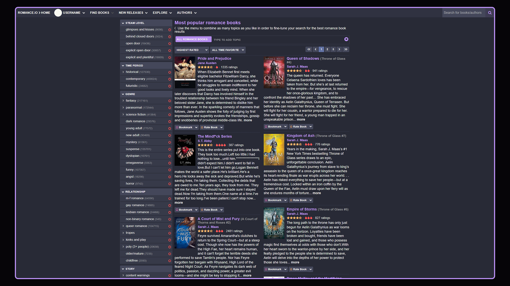

# Dracula for [Romance.io](https://romance.io)

> A dark theme for [Romance.io](https://romance.io).

## Install

1. Download the open-source Stylus extension for [Google Chrome](https://chromewebstore.google.com/detail/clngdbkpkpeebahjckkjfobafhncgmne), [Mozilla Firefox](https://addons.mozilla.org/en-US/firefox/addon/styl-us/), or [Microsoft Edge](https://microsoftedge.microsoft.com/addons/detail/styluswithoutnetwork/hckpgdidacmniaahncgfiihaklijbnhf?hl=en-US).
2. Install using this link: https://userstyles.world/api/style/25124.user.css

## Team

This theme is maintained by the following person(s) and a bunch of [awesome contributors](https://github.com/dracula/foobar/graphs/contributors).

|  |
| -------------------------------------------------------------------------------------------------------- |
| [TylersApps](https://github.com/TylersApps)            

## Community

- [Twitter](https://twitter.com/draculatheme) - Best for getting updates about themes and new stuff.
- [GitHub](https://github.com/dracula/dracula-theme/discussions) - Best for asking questions and discussing issues.
- [Discord](https://draculatheme.com/discord-invite) - Best for hanging out with the community.

## License

[MIT License](./LICENSE)
